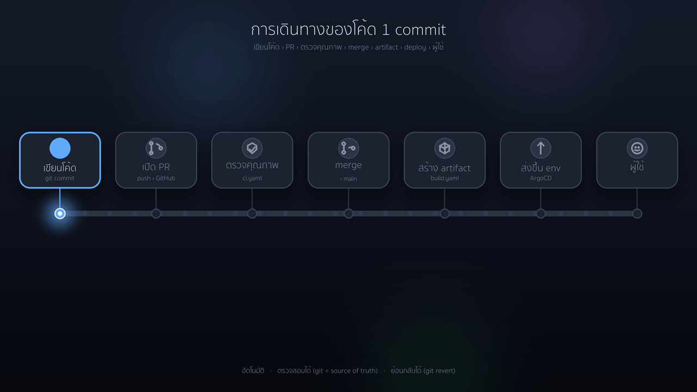
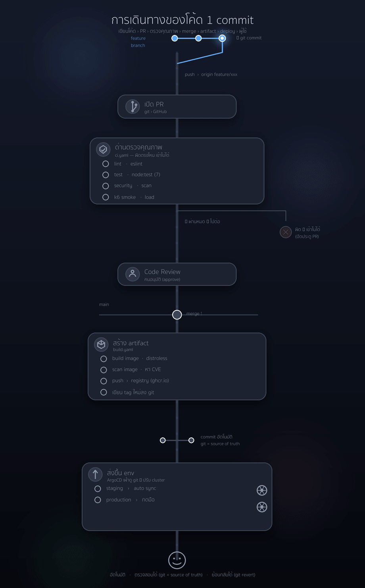

# cicd-gitops-101

> 📚 **โปรเจกต์เชิงการศึกษา (learning reference)** — ทำขึ้นเพื่อเป็นตัวอย่างให้
> ศึกษา **CI/CD + GitOps** แบบครบวงจร ตั้งแต่ commit จนถึง production
> พร้อมคำอธิบายเหตุผลของทุกขั้นตอน รันตามได้จริงบนเครื่องตัวเอง

`cicd-gitops-101` คือ Node service ตัวเล็ก ๆ ที่ห่อด้วย **CI/CD + GitOps pipeline
ระดับโปรดักชัน** ตัวแอปตั้งใจทำให้ง่ายที่สุด เพราะหัวใจของ repo นี้คือ
**delivery pipeline** ไม่ใช่ตัวแอป — ด่านตรวจคุณภาพ, สแกน supply chain ของ
คอนเทนเนอร์, ด่านวัดประสิทธิภาพด้วย k6, จัดการ environment ด้วย Kustomize และ
GitOps ด้วย ArgoCD ที่มีด่านอนุมัติ production ด้วยมือ

### จะได้เรียนรู้อะไรจาก repo นี้

- เข้าใจ **CI/CD pipeline** จริงทั้งเส้น: PR → quality gate → build → deploy
- เข้าใจหลักการ **GitOps** (git เป็น source of truth) และวิธีที่ ArgoCD ทำงาน
- เห็นว่าควรวาง **ด่านคุณภาพ** (lint / test / security / performance) ไว้ตรงไหน และเพราะอะไร
- เข้าใจการแยก **staging (sync อัตโนมัติ)** ออกจาก **production (อนุมัติด้วยมือ)**
- เข้าใจ **rollback ที่ถูกวิธี** ด้วย `git revert` แทนการแก้ที่เครื่อง
- ลองรันทั้งระบบซ้ำได้บนเครื่องตัวเองด้วย `make demo` (kind + ArgoCD)

## การเดินทางของโค้ด 1 commit (ดูภาพรวมแบบเห็นภาพ)

<p align="center">
  
  <br><sub>ภาพรวมแนวนอน — commit วิ่งผ่านแต่ละด่าน (ตรวจคุณภาพ → build → deploy) จนถึงผู้ใช้</sub>
</p>

<p align="center">
  
  <br><sub>ฉบับละเอียด (git graph) — รวมจังหวะ rollback ด้วย <code>git revert</code> เมื่อ production พัง</sub>
</p>

ลองคิดว่ามันคือ **การเดินทางของโค้ด 1 commit** ตั้งแต่เขียนเสร็จจนถึงมือผู้ใช้ —
ทุก "ด่าน" คือสิ่งที่ทีมจริงต้องมีเพื่อกล้าปล่อยของขึ้น production บ่อย ๆ โดยไม่พัง:

```
เขียนโค้ด → เปิด PR → [ด่านตรวจคุณภาพ] → merge → [สร้าง artifact] → [ส่งขึ้น env] → ผู้ใช้
```

### 1) เส้นทางปกติ — โค้ดเดินหน้าจาก commit ถึงผู้ใช้

| ด่าน | ไฟล์ | ทำอะไร | ถ้าไม่ผ่าน |
| --- | --- | --- | --- |
| 🚧 **ตรวจคุณภาพ** | [`ci.yaml`](.github/workflows/ci.yaml) | lint · unit test · `npm audit` · Trivy · k6 smoke | **PR เข้าไม่ได้** (ปิดประตู) |
| 👤 **Code Review** | branch protection | คนอนุมัติก่อน merge | merge ไม่ได้ |
| 📦 **สร้าง artifact** | [`build.yaml`](.github/workflows/build.yaml) | build image (distroless) → scan CVE → push GHCR → เขียน image tag ใหม่ลง git | build ล้ม ไม่มี image |
| 🚀 **ส่งขึ้น env** | [ArgoCD](argocd/) | ArgoCD เฝ้าดู git → ปรับ cluster ให้ตรง | sync ล้ม / rollback |

> **staging** sync อัตโนมัติ (เร็ว ทดลองได้) แต่ **production** ต้องมีคนกด ([`promote-prod.yaml`](.github/workflows/promote-prod.yaml)) — กันของหลุดขึ้น prod โดยไม่ตั้งใจ

### 2) ตอนของพัง — ย้อนกลับด้วย `git revert`

ถ้าเวอร์ชันใหม่มีปัญหาบน production การ rollback **ไม่ใช่** การ ssh เข้าไปกู้ของที่เครื่อง
แต่เป็น **git operation** ที่ตรวจสอบได้:

```
🔴 ของพัง  →  git revert  →  commit ใหม่ที่ชี้ image tag "เวอร์ชันเดิม"
                                   │
                                   ▼
                       🟢 ArgoCD เห็น git เปลี่ยน  →  ปรับ cluster กลับเวอร์ชันเดิมอัตโนมัติ
```

- `revert` = **สร้าง commit ใหม่** (ไม่ใช่ลบของเก่า) → ประวัติยังครบ ตรวจสอบได้ว่าใครย้อน ตอนไหน เพราะอะไร
- ย้อนที่ **git** (source of truth) ไม่ใช่ที่เครื่อง → cluster ปรับตามเอง เส้นทางเดียวกับตอน deploy
- เร็วและปลอดภัย เพราะ image เก่ายังอยู่ใน registry แล้ว — แค่ชี้ tag กลับ

### 3) หัวใจ 3 ข้อที่ทำให้กล้าปล่อยของบ่อย ๆ

| หลักการ | หมายความว่า |
| --- | --- |
| **อัตโนมัติ** | ไม่มีใคร ssh เข้า server แล้ว `git pull` — ทุกขั้นเป็นเครื่องทำ ไม่พลาดจากมือคน |
| **ตรวจสอบได้** | git คือความจริงเพียงหนึ่งเดียว อยากรู้ prod รันอะไร? ดู git ได้เลย |
| **ย้อนกลับได้** | rollback = `git revert` → ArgoCD sync กลับให้เอง |

## เจาะลึกแต่ละขั้น (อ้างอิงไฟล์จริง)

หากดูภาพรวมจาก GIF แล้วอยากเข้าใจกลไกข้างใน นี่คือสิ่งที่เกิดขึ้น **จริง ๆ**
ในแต่ละขั้น โดยอ้างอิงไฟล์จริงใน repo:

### ขั้นที่ 1 — เปิด PR เข้า `main` → CI รันทันที ([`ci.yaml`](.github/workflows/ci.yaml))

- **เมื่อไหร่:** ทุกครั้งที่เปิดหรืออัปเดต Pull Request ที่ยิงเข้า branch `main`
- **รัน 4 job พร้อมกัน (ขนาน):**
  - `lint` — `npm ci` แล้ว `npm run lint` (ESLint) — เช็คสไตล์/บั๊กเบื้องต้น
  - `test` — `npm run test:ci` — unit test + coverage
  - `security` — 2 ชั้น:
    - `npm audit --omit=dev --audit-level=high` — เช็ค dependency ที่ใช้จริง (ไม่รวม dev) ถ้าเจอช่องโหว่ระดับ high ขึ้นไป → fail
    - **Trivy** สแกนไฟล์ (`scan-type: fs`) ระดับ `HIGH,CRITICAL` เจอแล้ว `exit-code: 1` (ข้ามตัวที่ยังไม่มี fix ด้วย `ignore-unfixed`)
  - `k6` — ทดสอบจริงบน container:
    - build image → `docker run` → วน `curl /readyz` รอจน service พร้อม (สูงสุด 30 วิ)
    - `k6 run smoke.js` (ดูว่ารับ request ได้) แล้ว `k6 run load.js` (**ด่าน perf** — fail ถ้า p95 หรือ error เกิน SLO)
- **ผลลัพธ์:** job ไหน fail → PR ขึ้นสถานะแดง → ถ้าเปิด branch protection ไว้ **merge ไม่ได้**

### ขั้นที่ 2 — คนรีวิว แล้ว merge

- มีคนกด **Approve** บน PR (บังคับด้วย branch protection)
- merge เข้า `main` → จุดนี้คือเส้นแบ่ง "ผ่านด่านคุณภาพแล้ว"

### ขั้นที่ 3 — push เข้า `main` → build artifact ([`build.yaml`](.github/workflows/build.yaml))

- **เมื่อไหร่:** ทุกครั้งที่มี commit ใหม่บน `main` (รวมถึงตอน merge)
- `test` (รันซ้ำอีกที เป็น gate ก่อน build) → `lint` + `test:ci`
- `build-and-push`:
  - คำนวณชื่อ image เป็นตัวพิมพ์เล็ก `ghcr.io/<owner>/<repo>` และ **tag = `sha-` + 7 ตัวแรกของ commit** (เช่น `sha-abc1234`) → ทุก build มี tag เฉพาะตัว ไม่ทับกัน
  - login เข้า **GHCR** ด้วย `GITHUB_TOKEN`
  - build จากโฟลเดอร์ `app/` แล้ว push 2 tag: `:sha-xxxxxxx` และ `:latest` (มี layer cache แบบ gha ให้เร็วขึ้น)
  - **Trivy** สแกน image ที่เพิ่ง build (`HIGH,CRITICAL`) — เจอช่องโหว่ → fail ไม่ปล่อยต่อ
- `promote-staging` — **หัวใจของ GitOps:**
  - `kustomize edit set image` ไปแก้ image tag ใน `gitops/overlays/staging`
  - `ci-bot` **commit + push การเปลี่ยน tag กลับเข้า git** → นี่คือ "เขียนเวอร์ชันใหม่ลง git" ที่เห็นใน GIF

### ขั้นที่ 4 — ArgoCD เห็น commit → deploy staging อัตโนมัติ ([`argocd/staging.yaml`](argocd/staging.yaml))

- ArgoCD Application `staging` เฝ้าดู repo ที่ path `gitops/overlays/staging` branch `main`
- `syncPolicy.automated` เปิดไว้:
  - `prune: true` — ลบ resource ที่หายไปจาก git ออกจาก cluster ด้วย
  - `selfHeal: true` — ถ้ามีใครไปแก้ cluster ด้วยมือ ArgoCD **ดึงกลับให้ตรง git**
  - `CreateNamespace=true` — สร้าง namespace `demo-staging` ให้เอง
- สรุป: พอ tag ใน git เปลี่ยน → ArgoCD ปรับ cluster ให้ตรงเองภายในไม่กี่นาที **ไม่มีใคร `kubectl apply` ด้วยมือ**

### ขั้นที่ 5 — promote ขึ้น production (ด้วยมือ) ([`promote-prod.yaml`](.github/workflows/promote-prod.yaml))

- **ไม่ทำอัตโนมัติ** — ต้องไปกดที่แท็บ **Actions → Promote to Production** เอง (`workflow_dispatch`) แล้วใส่ `image_tag` ตัวที่ผ่าน staging มาแล้ว
- `environment: production` → ถ้าตั้ง **required reviewers** ไว้ workflow จะ**ค้างรอคนอนุมัติ**ก่อน (= ด่านคนใน GIF)
- หลังอนุมัติ: `kustomize edit set image` ใน `gitops/overlays/production` → `ci-bot` commit + push
- ArgoCD ฝั่ง production เป็น **manual-sync** → ต้องไปกด **Sync** ใน ArgoCD อีกที (ปลอดภัยอีกชั้น)

### ขั้นที่ 6 — ถ้า production พัง → rollback ด้วย `git revert`

- `git revert` commit ที่ bump tag (หรือแก้ tag กลับเป็นตัวเดิม) แล้ว `push`
- ArgoCD เห็น git เปลี่ยน → sync cluster **กลับเป็นเวอร์ชันเดิม**
- ไม่ต้อง build ใหม่ เพราะ image เก่ายังอยู่ใน GHCR — แค่ชี้ tag กลับ
- ประวัติครบ: ดู git log ได้ว่าใครย้อน ตอนไหน เพราะอะไร

## สิ่งที่ repo นี้ครอบคลุม

| เรื่อง | มีอะไร |
| --- | --- |
| ด่านคุณภาพ CI | lint, unit test + coverage, `npm audit`, Trivy สแกนไฟล์ |
| ด่านวัดประสิทธิภาพ | **k6** smoke + load มี SLO threshold (p95 < 200ms, error < 1%) |
| คอนเทนเนอร์ | Dockerfile หลาย stage, distroless, ไม่รันด้วย root, rootfs อ่านอย่างเดียว |
| ความปลอดภัย supply chain | สแกน image ด้วย Trivy, push ขึ้น GHCR, tag ตาม commit SHA |
| จัดการ config | **Kustomize** base + overlay `staging`/`production` |
| GitOps | **ArgoCD** Applications; staging sync อัตโนมัติ, production กดเอง |
| การ promote | เลื่อนข้าม environment ผ่าน GitHub Environment ที่ต้องมีคนอนุมัติ |
| ลองรันซ้ำได้ | `make demo` สร้าง kind + ArgoCD บนเครื่องได้เลย |

## ภาพรวม pipeline (ฉบับย่อ)

```
PR ─▶ [lint · test · security · k6] ──merge──▶ main
main ─▶ build image ─▶ Trivy scan ─▶ push GHCR ─▶ bump staging overlay (git commit)
        ArgoCD เห็น commit ─▶ auto-sync STAGING ─▶ ด่าน k6 perf
        คนอนุมัติ ─▶ promote-prod ─▶ bump prod overlay ─▶ ArgoCD manual-sync PRODUCTION
```

ไดอะแกรมเต็ม + เหตุผลการออกแบบ: [docs/architecture.md](docs/architecture.md)

## โครงสร้างโปรเจกต์

```
app/                  Node (Express) service + เทส + Dockerfile
tests/k6/             k6 smoke / load / stress (ใช้ SLO threshold ร่วมกัน)
gitops/
  base/               Kustomize base (Deployment, Service, HPA)
  overlays/staging/    config staging (CI bump image tag ที่นี่อัตโนมัติ)
  overlays/production/ config production (promote เองด้วยมือ)
argocd/               ArgoCD Application manifests (staging + production)
.github/workflows/    ci.yaml · build.yaml · promote-prod.yaml
Makefile              คำสั่ง dev + เดโม kind/ArgoCD บนเครื่อง
```

## เริ่มใช้งาน (บนเครื่อง)

```bash
# 1. แอป: ติดตั้ง, เทส, รัน
make install
make test
make run            # http://localhost:3000/api/hello?name=you

# 2. คอนเทนเนอร์ + k6  (host port 3001 -> container 3000)
make docker-build                       # build image ชื่อ cicd-gitops-101:dev
docker run -d -p 3001:3000 --name demo cicd-gitops-101:dev
curl localhost:3001/healthz
BASE_URL=http://localhost:3001 make k6-smoke
docker rm -f demo

# 3. เดโม GitOps เต็มรูปแบบบน cluster ในเครื่อง (ต้องมี kind + kubectl + argocd)
make demo           # สร้าง kind cluster + ArgoCD + ลงทะเบียน Applications
make argocd-ui      # แล้วเปิด https://localhost:8080
make argocd-password
```

## ก่อน fork ไปใช้เอง

manifest ทั้งหมด (ArgoCD / Kustomize) ตั้งค่าไว้สำหรับ **`ponpond`** แล้ว —
image `ghcr.io/ponpond/cicd-gitops-101`, repo `github.com/ponpond/cicd-gitops-101`
ถ้า fork ไปใช้ ให้ชี้มาที่บัญชีตัวเอง:

```bash
grep -rl ponpond . --exclude-dir=.git | xargs sed -i '' 's/ponpond/<your-username>/g'   # macOS
```

จากนั้นใน Settings ของ repo:

1. **สร้าง lockfile**: รัน `make install` แล้ว commit `app/package-lock.json`
   (CI ใช้ `npm ci` ซึ่งต้องมีไฟล์นี้)
2. **Environments → `production`**: เพิ่มตัวเองเป็น required reviewer เพื่อเปิดด่านอนุมัติ production
3. **Branch protection บน `main`**: บังคับให้ CI ผ่านก่อน merge

## เหตุผลเชิงออกแบบ (design decisions)

- **GitOps แทนการ deploy แบบสั่งมือ** — git คือ source of truth; CI ไม่แตะ
  cluster; rollback คือ `git revert`
- **build ครั้งเดียว แล้ว promote artifact เดิม** — image ตัวที่ผ่าน staging คือ
  ตัวเดียวกับที่ขึ้น production (ไม่ build ใหม่แยกตาม env)
- **ป้องกันหลายชั้นบน supply chain** — audit dependency, สแกนไฟล์, สแกน image,
  runtime แบบ distroless + non-root
- **ประสิทธิภาพเป็นด่าน ไม่ใช่คิดทีหลัง** — k6 threshold ทำให้ pipeline fail
  เมื่อ latency/error เกิน SLO
- **ใส่ด่านคนตรงที่ควรใส่** — staging อัตโนมัติเพื่อความเร็ว; production ต้องอนุมัติก่อน

## สัญญาอนุญาต (License)

MIT
