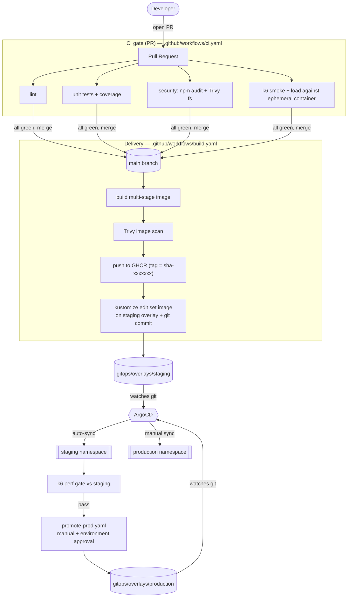

# Architecture

## End-to-end flow

## Why GitOps (and not `kubectl apply` in CI)

- **Git is the single source of truth.** The cluster state always matches what's
  committed. No "what's actually running?" mystery.
- **CI has no cluster credentials.** CI only pushes an image and edits a YAML
  tag. ArgoCD (inside the cluster) pulls changes. Smaller blast radius, fewer
  secrets in CI.
- **Rollback = `git revert`.** Roll back a deploy the same way you roll back code.
- **Drift correction.** ArgoCD `selfHeal` reverts manual cluster edits back to
  the committed state.

## Environment promotion

| Stage | Sync | Image tag source | Replicas |
| --- | --- | --- | --- |
| staging | ArgoCD automated (prune + selfHeal) | auto-bumped by `build.yaml` on every merge | 1 |
| production | manual sync + GitHub Environment approval | promoted by `promote-prod.yaml` (workflow_dispatch) | 3 |

The same image artifact (by digest/tag) that passed staging is what ships to
production — build once, promote the artifact, never rebuild per environment.
